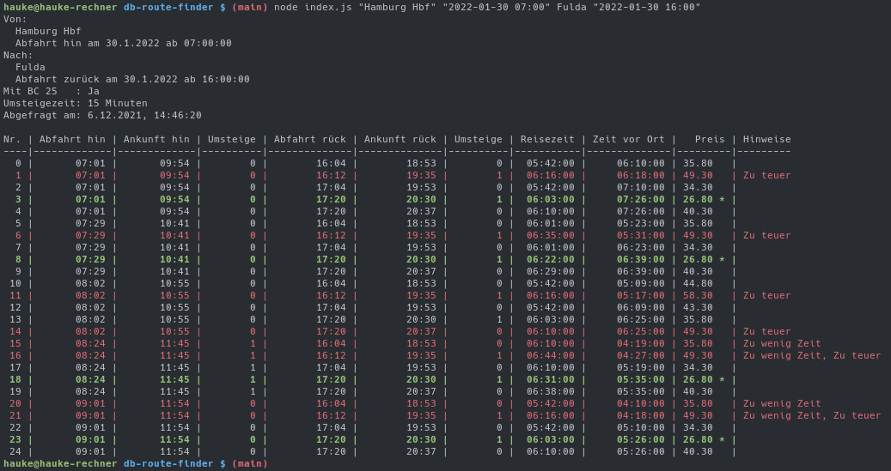

# DB Route Finder

A tool to find optiomaoptimal routes from A to B and B to A.

An optimal route should fulfill certain properties:

* All journeys should happen on the same day (A to B and back B to A on the same day)
* The time at B (so between arriving at B and departing from B) should be sufficient (currently at least 5 hours)
* The price should be minimal
* The exact departure and arrival times are irrelevant as long as all above properties are fulfilled

# Getting started

1. Clone this repo
2. Install dependencies: `npm i`

# Usage

`npm run start <from> <from-departure> <to> <to-departure>`

* `from`: The Station name where your journey starts.
* `from-departure`: The earliest time you are willing to depart.
* `to`: The Station you want to go to.
* `to-departure`: Optional: The earliest time you want to head back home. If not present, the `from-departure` day will be used at 4pm.

## Example

`npm run start "Hamburg Hbf" "2021-12-14 07:23" Fulda "2021-12-14 14:50"`

`npm run start "Hamburg Hbf" "2021-12-14 07:23" Fulda` which is equivalent to `npm run start "Hamburg Hbf" "2021-12-14 07:23" Fulda "2021-12-14 16:00"`

## Help

To print helping information:

`npm run start -- --help`
